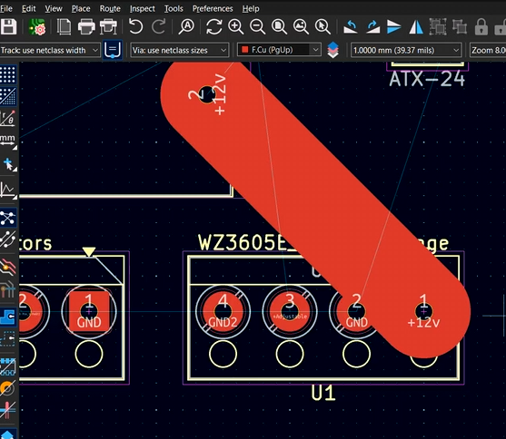
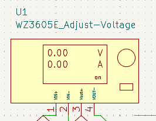
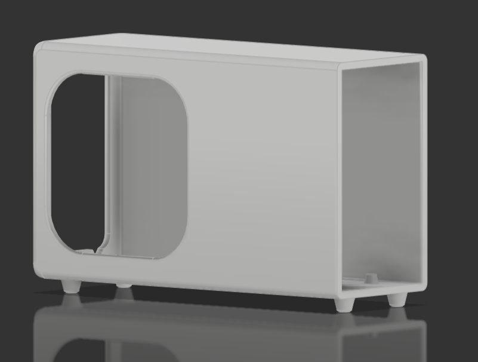
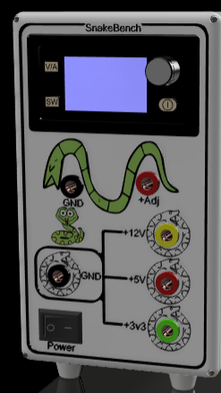
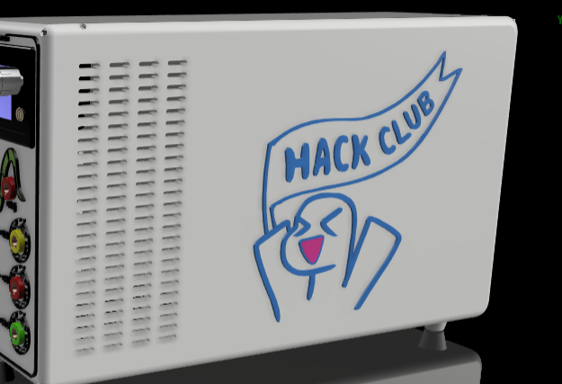
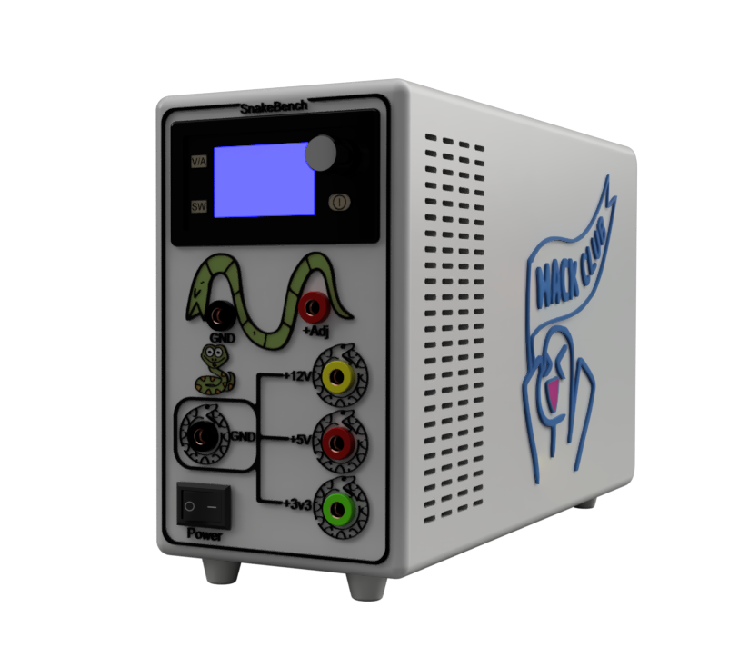
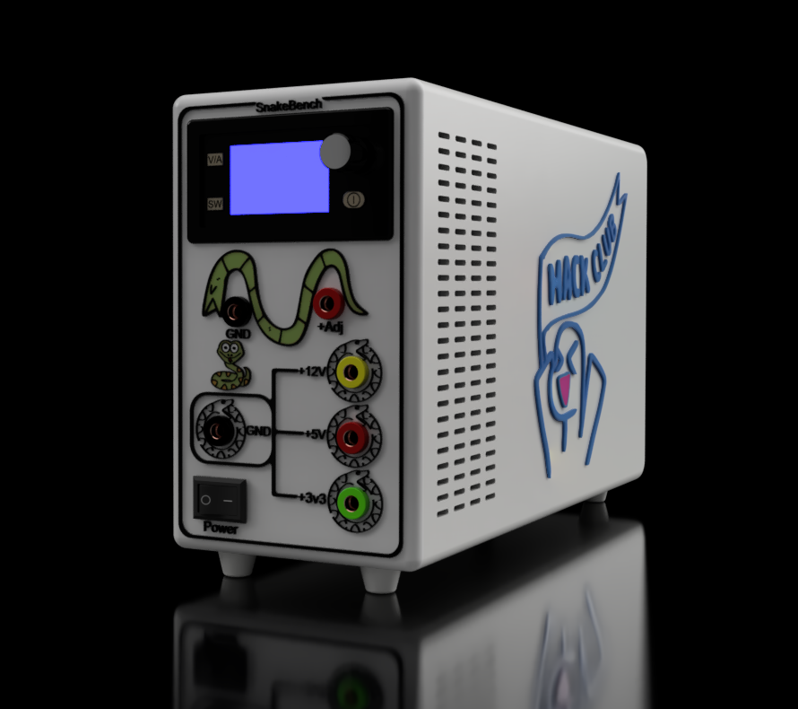
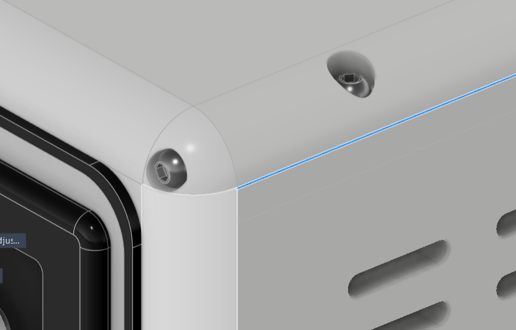

# SnakeBench (Journal)

## Entry 1:
- Author: Nader
- Date: 16/07/2026

### Content:

Uhhhh, I will die while writing this Entity 😭.

BROOOO, A 12 HOURS SESSION IS INSANEEE.

BUT I need to lock in for arcana 😭.

Ok well, let me try to organize this entity well so it can be super easy to read for you. ❤️

In this Session, well i think i made 80% of the project.

So let me write the points and break them down.

- Searched about the components i will need and will use.
- Started with the schem and found an ATX symbol that i can use the power buses from.
- Made my own symbol for the adjuster.
- Edited the Pinheader symbol to make a banana plug.
- Started connecting everything in the Schem
- Searched about the 2 ways to connect a Switch to the PSU.
- Searched about the Fuses types. 
- Assigned all the Footprints.
- Was searching about how to connect more then 1 symbol with one footprint. 
- just edited the symbol.
- Found a problem with the tracing width, so changed to terminal blocks.
- Finished the PCB. 
- Imported to fusion.
- searched for the PSU well dimensioned.
- Made the backCase.
- Fixed its stopper.
- made hole for the fan. 
- made the PCB place.
- screws for the PSU.
- Screws for the PCB.
- Making the frontpanal.
- Got a reference project to get the adjuster from.
- got some snakes.
- Started designing the panal interface and polishing at the same time. 
- added the components of the panal.
- changed appearances for each.

Pheww!!

WTH wait that's the points only. 😭

BRUHHH.

Ok let me break those points down.

Gonna need to make sections and each one will has its related things. Even if they are not in order.

Just to make it readable. 

#### Research (All the research i made for all the section down there):

##### Schem & Circuit
------
OK, i will talk in section about all the researched things i knew.

Umm, the first thing i searched about is WTH is the bench power supply looks like.

So, i saw many vids (not in the rec) and found people converting Old PSU to a beauty that sits on the table and serve me.

So, of course decided to make it.

The first thing i searched about are the banana Plugs and if they are in Egypt.

and yeah i found them pretty cheap, So i moved to the next rare thing in my country.

Whice is the voltage Adjuster with the screen and current limitter.

Well, tbh i found some, but they were kinda old, and the other were without a screen.

So, i found it on aliexpress and it was pretty cheap so iam gonna buy it from there if i will build this.

After searching for these two things, i was kinda ok what whetever else i will search about since the rare two i already found.

So, i just started searching about the symbols iam gonna use in the schem, and found the ATX symbol that connects the power buses, and the PS-ON, and all the other wires.

Alse searching about the adjuster if i will find a symbol but didn't find any.

Same thing for the BananaPlug. (this can be used as a pinheader anyways.)

##### PCB
-------

Well ok this section will talk about the things i searched about in the PCB design phase.

Well, look. 

THIS THING CANNOT JUST FLOW IN A 0.5 mm 1 oz WIRE, So i needed to search about those concepts.

First the OZ, it is the thickness of the copper layer of the PCB, and it usally come as 1 or 2 OZ.

and also the Trace width, it is the tracks width (bro litearly its name explain everything)

So, i searched about the minimum track width that can flow max of 12V and 10A.

I found that it needs to be 8 mm for 1 OZ copper layer, and 3.2 mm for 2 OZ Copper layer. Well, i need to print in 2 OZ, to prevent this shit.

And also 3 mm won't be able to connect to this small ATX connector. Sooo, iam just gonna use terminal blocks, to be able to connect more than one wire from the same bus of the PSU, so i can prevent over heat and death.

that's it for the PCB ig.

##### 3D:
-----------------

Well, for this one. i don't have to say that i searched for all the module to add to he assembly.

but, i didn't find the adjuster anywhere, but i found it only in a project someone else made and put on GrabCad. So, i downloaded it and took the module from it.

And i also searched for some snakes photos that i can use by converting to DXF. 

Also searched for people made this BPS before so i can see the panal style and try to make my own.

And yeah of course while iam working i was searching for tools to make it easier on fusion, like the chain select tool (Which is just a double click), and how to inverrt the selection, and so on.

Actually there is nothing important to say here. All my experience helped me already with that all.

that's it for the 3D research too.

#### Schem: 
Ok, Now we're talking about the actuall working in this journal. 

With the first phase (After researching of course)

The schemmmmaticcc.

Well, i didn't make any schematic that easy before. 

Only 2 GNDS and labels and wires for the cables. 

This was super easy to make, it is just that the adjuster module, i made my self and drew it and gave it 4 pins (2 INs and 2 OUTs).

and connected it to the 12V bus but there is a fuse in the middle of the + wire.

And for the banana Plugs, well i know i can just use a 1 pin header, i wanted the schematci to be more detailed. so i edited it and added drawings to make it kinda like the banana plug.

This was good until i found that i can't assign more than one symbol to the same footprint, So i edited it again and added all the other bananas to the same symbol to be like a 6 pinheader.

After finishing connecting them, i finished the schem and iam ready now to go to the PCB.

Oh wait, dk i said that or not, but the PCB is a Fuse box for the Voltage buses.

This is the full schematic:

#### PCB:

After finishing the Schematic, i proceeded to the PCB, and started wit assigning all the footprint to the Symbols.

well, as iam using a glass fuse which handels 10A, So i needed the footprint to be in a T6 * 30 size fuse. So i neededa fuse holder with the same size. 

After assigning also the terminalBlocks from a previous project, and finished assigning all the footprints.

know it is the most hard point, The tracingggggg 😭

Well, for this one as i said in the research section, i needed to be super careful because this can't be done wrong.

after searching and getting what i need, i traced all of them with a 3 mm trace width, and i need to print the PCB in 2 OZ, so it can prevent over heating and fire and deathhhhh 💀

Well, after tracing, i finished it and it looks cool tbh.

#### 3D: 

##### Back Case:
-------------------

Well, now we come for the most super fun part, bro i made a master pieceeeee 😍.

After finishing the PCB, I imported it into Fusino, and as i said in the research section, i search about all the components iam gonna use, like the well dimensioned PSU, and after finding them all, i added them to the Fusion project, and added the PSU to the fusion assembly, cause i wantted to build the case arround it. 

after adding the PSU there, drew the sketch of the back, and extruded it, So it can cover the PSU and also give space for the PCB, and wires.

After finishing this part, the extrud of the back extended plastic that stops the PSU in its place, had some issues, So i canceled the extrud and did it again with right directions this time.

that's it for this session about this back case

##### Panal:
-------------------------

Well, for this one, i made an empty Part Studio, and then added it to the assembly so i can edit in place (in context).

So, after doing that, i started a sketch for the panal on the front of the backcase, and then i started projecting all the outline of the case and made the front panal.

After that, i started making the style of the panal.

Well, i loved to polish it at the same time. so it can looks cool, with ideas improving.

After that, I searched for snakes and converted them to dxf and add them to the 3d sketch

Well, i got round ones for the fixed voltage buses and their GND, and for the adj + and GND, i got a snake that liike rotate or walk on them.

I added it and extrudded and changed the appearance of the bodies(yeah i made all the styles on the panal to be separate bodies, so i can print in a color)

i also added the adjuster after i got it from the reference project and added the banana plugs.

------------------

Well, after that the session got its maximum and i couldn't record more on the same session 😭😭.

So i just opened a new lapse, and saved this one

### Recording Links (12.5 hours):
- https://lapse.hackclub.com/timelapse/JLS1yX13ARrh

## Entry 2:
- Author: Nader
- Date: 18/07/2026

### Content:

First, the FREAKING fusion kept freazing and lagging and even crashing, which somethimes leads me to redo some points. Well, i hate this thing. i really like it but dk why it is so buggy. 😭

Ok after opening the next Recording, i continued working on the 3D.

When i came here.

i added holes for air to flow, i used the pattern tool for that, it was super easy to use, and i made 4 columns and 24 rows iirc.

in the front besides the PCB, and the adjuster, 'cause i made already a big hole for the PSU fan.

I also got the right side of this back case, and added orphues to it after editing its png in inkscape and getting the dxf. 

and then fixed it in fusion using a technique where i keep putting straghit lines to divide the whole shape and then i see if the hidden open end is on the right or the left, i kept doing this till i ended up catching this hidden open area and fixed it, and then extruded orphues to be individual parts so also i can color them.

I extruded it 1 mm in front of the face, and 2 mm into the case it self, and i also cleared this area for it, so i can print them and glue them easily.

and did the same thing with the other drawings on the panal, cause i want them with their colors. 

They llooks soo cooool

And yeah i also added an other snake under the adj GND 'cause i felt it was kinda empty, and made it with the same thing.

Well, after making these entities capable of rainforcing to panal and the Back Case.

I needed to export all the files of the Printables to files for each color, tbh i thought i need tto do it for each body at first, but i found that i just can make it for each color.

so i kept selecting all the body liked colors, and exporting them in one obj file. 

till i finished it all and now i have on this [Directory](<Production/3D Printables>), all the 3D printable files that anyone can take now and print them and assemble them.

But yeah before exporting, i Added Screw holes and screws and insert to the front panal and the back case. 

and at the end i kept searching about the parts and made the BOM.md and BOM.csv.

Well, after finishing this project, i hated how i left all my previous project without tidding up in the fusion docs or project file, so i scanned all the time line and renamed every thing so it can look soo clean for anyone reads it for first time.

And after that all i started the mooooost beautiful thing in fusion, that's why i love this app..

The renderingggggg, well, first i gave everything good materials that will look cool when i render like ABS and plastic, So, after giving them all the appearances assignment, i opened the render workspace and then tried to render without making any change in the Lighting.

and that's what i got:

anddd after adding some lighting plane, i got this:

After i moved to the documentation phase, Well, i saw a very stupid problem when i was writting the README.md.

Bro who the hell i will get the PSU inside the case, while the PCB place extruded area is there.

Sooo, yeah i reopend a new lapse and cut the top of the back case the i can install the PSU from the top, and added four screws to it.

So, This is the last version of this awesome project:

### Recording Links (8.2 Hours): 
- https://lapse.hackclub.com/timelapse/hhvo80xgkMCD
- https://lapse.hackclub.com/timelapse/6Wea93oyLyp9
