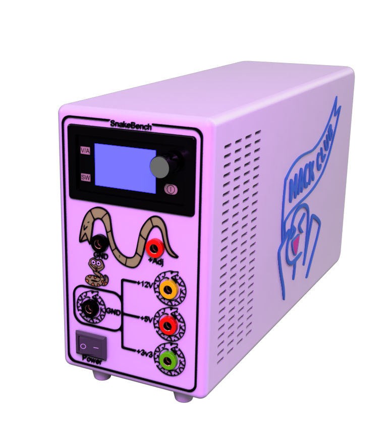
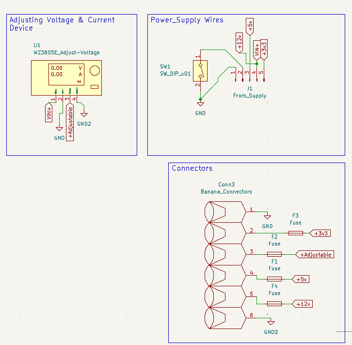
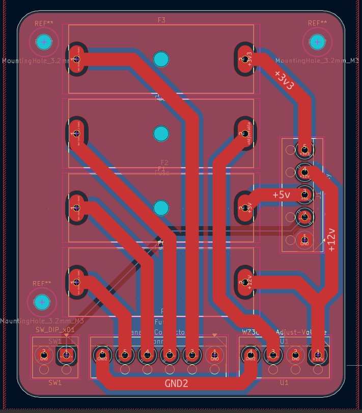
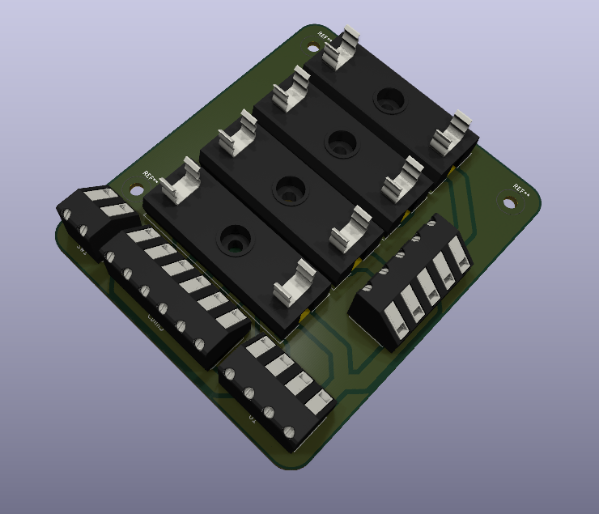
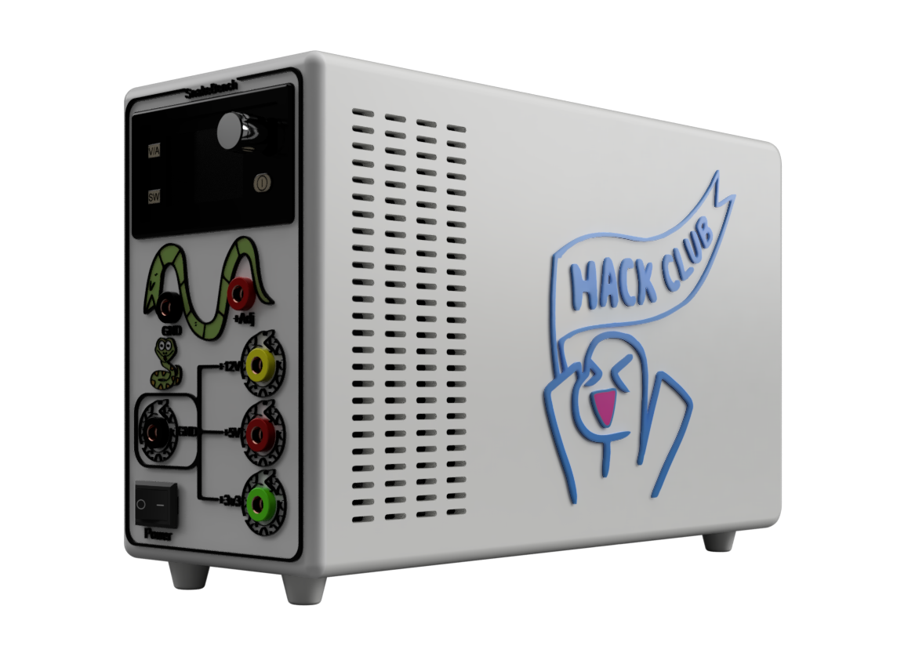
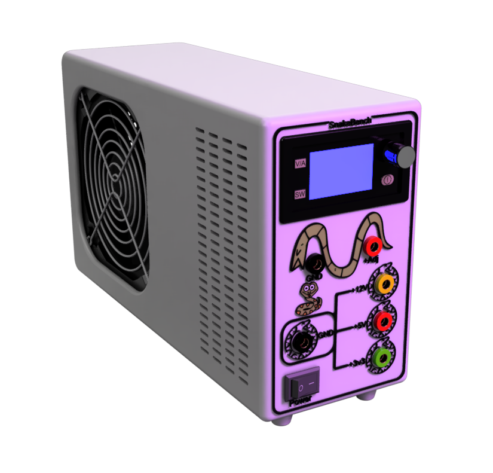

# SnakeBench
----------------

  

-----------------

## Description:

A snake-Styled Desktop Bench power supply, With adjustable Voltage, and fixed outputs.

## Why Iam Making this?

I have an old PC, and iam not using it anymore since i have another one. So, I decided to take components from it and convert them into Cool project. 

So, Iam starting with this one, Converting a PSU into a Cool Bench Power Supply that will help me with my Hardware Projects, and of course making it in a Snake-Style.

## Features:

- Banana Plugs for easy connect.
- Fixed Voltages came directly from the PSU.

    - +12V
    - +5V
    - 3v3

- Adjustable voltage plug with a digital screen to show the readings.
- Current limiting function.
- Fuse Box limiting the current to 10A.

## Photos: 

### Schematic:

### PCB:

### 3D PCB:

### 3D Assembly:

> [!NOTE]
> Here You Go the [Fusion Assembly Link](https://a360.co/4wditMu)

### How To Build:

1. Print all your parts.
2. Solder the Fuse Holders and the terminals to the PCB.
3. Add the Fuses to the Holders.
4. Get your PSU and install it inside the Case.
5. Rainforce it using the Screws from the back.
6. Add your PCB on its place in the Case.
7. Rainforce it using the Screws.
8. get 4 or 5 of each fixed voltage wires and connect them inside each terminal_Block. (For each Voltage Bus)
9. Take 3 or 4 wires of the Yellow wires (The 12V) and connect them to the input of the Voltage adjuster.
10. Connect the GND to the adjuster and to one Black Banana Plug to use it as the GND of the fixed voltage buses.
11. Connect the GND comming from the Adjuster to the one another Banana Plug to use it as the -Adj.
12. Connect also the +Out of the adjuster to one Red Banana Plug to use it as the +Adj.
13. Connect each Fixed Voltage bus to its banana Plug. 
    - Yellow --> +12V
    - Red --> +5V
    - Green --> 3v3
14. Rainforce all the Banana Plugs to the Front Panal. 
15. Rainforce the Adjuster to its place on top with its clips.
16. Take the other Color printed Front Panal Drawings, and rainforce them with super glue each on its place.
17. Do the same to Orphues on the right of the Back case.
18. Take the button, and connect one terminal of it to 1 GND wire from the PSU, and the other terminal connect to the Green wire coming from the PSU (PS-ON).
19. Rainforce it into the Panal using its clips.
20. Review all the connections and make sure nothing shorted. 
21. Close the front panal with M2 Screws with the back case. 
22. Becareful and plug it for first time and try it.
23. ENJOYYYY ;)

------------------------------

# Made with ❤️, By @Nadoooor
